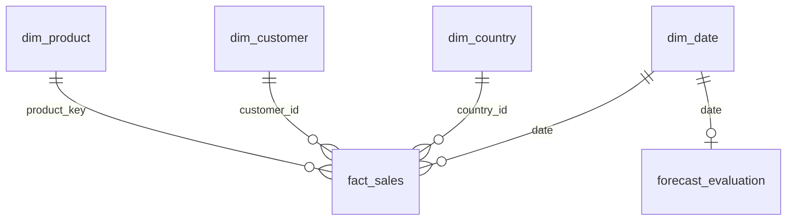

# UCI Retail Observatory

**End-to-End Retail Data Analytics, Machine Learning & Power BI**

[](https://www.python.org/) [](powerbi/) [](LICENSE)

An executable, auditable Python project for retail analytics and next-day recorded-sales forecasting. It processes the real UCI Online Retail II workbook through 25 dedicated stages: acquisition, data quality, relational modeling, SQL, statistics, visualization, machine learning, Power BI export and reporting.

The business problem is to understand historical sales concentration, cancellation exposure and customer activity, then test whether next-day recorded gross sales can be forecast more usefully than a same-weekday baseline. This is a historical research project; it does not claim current commercial deployment validation.

## Power BI dashboard showcase

A **three-page Power BI Desktop report** complements the Python/SQL pipeline. These are screenshots of the completed report pages, not mockups. The dashboards use the exported retail fact/dimension data and DAX measures; a `.pbix` file is **not currently confirmed as part of this repository**.

### 1. Executive Overview

Five KPI cards summarize recorded gross sales, cancellation value, known buyers, sale invoices and average invoice value. A monthly trend presents historical sales across December 2009–December 2011.


### 2. Sales & Operational Performance

Country rankings, daily sales, cancellation-to-sales ratios by country and average daily sales by weekday. Cancellation ratios compare recorded amounts; they are **not** order-cancellation probabilities.


### 3. Customer & Product Analytics

Top product descriptions, top identified customers, observed purchase-frequency bands, and known vs anonymous gross sales. Purchase-frequency bands are a **static snapshot at model refresh**, not dynamically recomputed across date slicers.


**Interpretation notes:** the source has non-merchandise descriptions such as `Manual`, `POSTAGE` and `DOTCOM POSTAGE`; these should not be interpreted as top physical products without additional filtering. Anonymous sales are preserved in headline totals. The final month is partial.

[Power BI import guide](powerbi/power_query_steps.md) · [Data model](powerbi/data_model.md) · [DAX measure catalog](powerbi/dax_measures.md) · [Dashboard design notes](powerbi/dashboard_design.md)

## Data and attribution

[Daqing Chen's Online Retail II](https://archive.ics.uci.edu/dataset/502/online%2Bretail%2Bii), UCI, DOI [10.24432/C5CG6D](https://doi.org/10.24432/C5CG6D), **CC BY 4.0**. The two-sheet workbook contains 1,067,371 source lines covering December 2009–December 2011. No credentials are required.

The sheets overlap in December 2010. The pipeline quarantines exact cross-sheet copies while preserving within-sheet multiplicity and uncertain repeats. Tables are derived from one source, not independent datasets. See [sources and limitations](docs/data_sources.md). Stage 01 records the actual UTC retrieval date, URL and SHA-256.

## Installation

Python 3.11 or newer; Windows PowerShell, VS Code and POSIX shells are supported. Use a project-local virtual environment.

```powershell
python -m venv .venv
.\.venv\Scripts\python.exe -m pip install -r requirements.txt
.\.venv\Scripts\python.exe -m ruff check .
.\.venv\Scripts\python.exe -m pytest
.\.venv\Scripts\python.exe main.py --all
```

On macOS/Linux, substitute `.venv/bin/python` for `.\.venv\Scripts\python.exe`. Activation is optional. The default source download is approximately 43.5 MB; allow additional disk space for immutable raw files, Parquet tables, the database and large CSV exports.

Dependencies: Pandas, NumPy, SciPy, Matplotlib, Seaborn, scikit-learn, sqlite3, PyYAML, requests, joblib, PyArrow, openpyxl, pytest and Ruff. Direct dependencies are pinned in requirements.txt; the actual installed full environment is recorded in requirements-lock.txt after verification.

## Execution and configuration

From the repository root, using your environment's Python:

```powershell
python main.py --all
python main.py --stage 3
python main.py --from-stage 7 --to-stage 15
python main.py --stage 18 --force
python src/03_data_profiling.py
python main.py --stage 22 --prediction-input data/features/sample_inference.csv
python main.py --help
```

An individual stage requires current upstream checkpoints. `--all` resumes verified artifacts; `--force` reruns selected stages. Edit `config/config.yaml` or pass `--config path/to/config.yaml` for paths, random seed, sampling, bootstrap repetitions, CV splits, worker count and tuning budget. Every failed stage is identified and dependent work stops.

Fingerprint checks cover source code, active configuration, SQL, dependency versions, upstream manifests and output hashes. Changed code/config conservatively invalidates the full chain. Rebuild with `--all`; verified raw downloads are reused. Run only one production pipeline process per checkout. No API keys or .env loader are needed.

## Architecture and repository structure


- `src/01_*.py` through `src/25_*.py`: dedicated stage implementations; `src/utils/`: reusable tested functions.
- `config/`, `sql/`: configuration, validation schema, logging, constrained database schema and 22 business queries.
- `data/{raw,validated,interim,cleaned,processed,features,powerbi}/`: immutable source and reproducible outputs, excluded from Git.
- `models/`: persisted pipelines, evaluation, predictions and model card; large trained artifacts excluded from Git.
- `reports/`, `visualizations/`: generated evidence, charts with interpretations and final report.
- `tests/`, `docs/`, `powerbi/`: automated tests, methodology, Power BI specifications and three dashboard screenshots.

See [pipeline architecture and checkpoints](docs/pipeline_architecture.md).

## Business questions and analytical methods

Twenty-two executable SQL questions cover gross sales, country/product contributions, cancellation ratios, anonymous sales, basket sizes, weekday/hour patterns, complete-month growth, year-over-year change, customer concentration, repeat purchases, cohorts, RFM, price variation, adjustment values and duplicate sensitivity. Each generated answer includes importance, query, full CSV output, measured interpretation and proposed action.

[Question catalog](docs/business_questions.md) · [Executed answers](reports/business_insights/sql_answers.md)

Raw/cleaned profiling measures nulls, cardinality, skewness, kurtosis, quantiles and memory. Cleaning logs reconcile every source record to accepted or quarantine. Statistical outliers are flagged, not indiscriminately deleted. Cohorts use first observed purchase and expose censoring. Descriptive metrics retain anonymous sales.

Customer-level UK/other-country contrasts use Welch and Mann-Whitney tests, effect sizes, bootstrap confidence intervals and Holm correction. Daily moving-block bootstrap acknowledges local serial dependence. Correlations and geographic differences do not establish causation. [Methodology](docs/methodology.md)

## Machine learning

Target: total recorded gross sales in GBP for day t, forecast immediately before that day. Use known calendar fields and shifted lags/rolling values through t−1. The potentially partial final day is excluded from labels. Chronological train/validation/test splits and expanding-window CV prevent future-label leakage.

Mean and same-weekday baselines, Ridge, Random Forest and histogram boosting are compared. Learned preprocessing and zero-variance selection fit only within training folds. Training-CV search and separate validation selection precede final refit on train+validation. Independent holdout metrics are MAE, RMSE, R² and WAPE; MAPE is omitted for zero-sales days.

Holdout evaluation is fixed-model rolling one-day-ahead: previous realized test days supply later lag inputs. It is not fixed-origin multi-step forecasting. Post-hoc permutation importance is diagnostic, not causal. The default inference example is an explicitly unscored replay on the final, possibly partial historical source date. User batches must supply correctly time-aligned engineered features.

[Actual computed results](docs/project_findings.md) · [Model card](models/model_card.md) · [Evaluation JSON](models/evaluation/holdout_metrics.json)

## Executed result snapshot

Local execution on 2026-10-08 processed **1,067,371 real source lines**, retaining **1,044,843** and quarantining **22,528**. Quarantine includes 22,523 cross-sheet overlap copies and five negative-price records.

Recorded gross sales: **GBP 20,533,741.92**; UK contribution: **85.1%**; distinct sale invoices: **40,077**. These are dataset observations, not audited financial results.

| Frozen model | Holdout days | MAE (GBP) | RMSE (GBP) | R² | WAPE |
|---|---:|---:|---:|---:|---:|
| ridge | 142 | 11,275.68 | 15,433.16 | 0.603 | 30.70% |
| Same-weekday baseline | 142 | 12,271.49 | 17,802.84 | 0.472 | 33.41% |

Holdout: 2011-07-20 through 2011-12-08. MAE improvement versus the seasonal baseline: **8.1%**. This is one historical holdout, not a statistical guarantee of future improvement.

## Visualization gallery

All final plots use 300 DPI and a consistent color scheme. [Visualization manifest](visualizations/manifest.json) lists each question, path and interpretation.


Additional plots cover missingness, anomalies, distributions, geographic baskets, correlations, contribution curves, statistical intervals and residuals. Samples are seeded and labeled.

## Power BI integration and modeling

Stage 24 produces six Power BI-ready CSVs in `data/powerbi/`: `fact_sales`, `dim_product`, `dim_customer`, `dim_country`, `dim_date` and `forecast_evaluation`, together with a data dictionary and validation manifest. Raw and generated data are not committed to Git; reproduce the exports by running the pipeline.

The Power BI report uses a star-style model with relationships from the product, customer, country and date dimensions to `fact_sales`, plus a separate calendar-to-forecast relationship. The forecast has **daily total-retailer grain** and should not be sliced by product, customer or country.



**Power BI product-key compatibility:** source product codes can differ only by letter case (for example `72529w` and `72529W`), while Power BI relationships handle text case-insensitively. In the manually built dashboard, a distinct numeric `product_key` was added to the product dimension and mapped into the sales fact through a case-preserving matching key. Original product codes remain available for display. This Power BI Desktop transformation is not claimed to be included in the Python export schema; see the screenshots and replicate it if importing the CSVs directly produces a duplicate-key relationship error.

The project documents [Power Query steps](powerbi/power_query_steps.md), [relationship specifications](powerbi/data_model.md), [23 baseline DAX measures](powerbi/dax_measures.md) and [the original five-page design proposal](powerbi/dashboard_design.md). **Three pages were actually built and captured**, as shown above; the five-page design document is a broader optional blueprint, not a claim that five report pages exist. Additional measures/columns were added in Power BI Desktop for customer segmentation and reporting. A distributable `.pbix` file has not been verified in the repository, so screenshots are the published dashboard deliverable.

## Tests and reproducibility evidence

`python -m pytest` includes schema/key/encoding errors, ZIP traversal, missingness, cancellation rules, identifier preservation, overlap-copy reconciliation, relational integrity, feature causality, chronological separation, train-only imputation, unseen valid calendar categories, inference, all 25 stages on offline synthetic test fixtures, and checkpoint corruption/invalidation.

Synthetic records are strictly test fixtures and never enter production reports. There is no arbitrary coverage-percentage gate; critical data integrity and leakage invariants are asserted. [Verification record](docs/verification.md) records actual commands and outcomes.

## Findings, limitations and next steps

Read the [final analysis report](reports/final/analysis_report.md), [business insights](reports/business_insights/insights.md) and [computed findings](docs/project_findings.md) for execution-derived values.

Limitations include a single historical retailer, incomplete identities, uncertain source line identity, non-merchandise codes, undocumented timezone, partial final periods, cohort censoring, no costs/inventory/exposure variables, and only hundreds of daily model examples despite a million source lines. No claims of profit, latent demand, causality or calibrated predictive intervals are made.

Next steps: obtain current transaction line IDs and operations calendars, validate forecasts on contemporary data, test multiple chronological origins and conditional uncertainty, and measure any proposed business intervention experimentally.

## License and acknowledgments

Code: [MIT](LICENSE). Dataset and derived materials: attribute Daqing Chen/UCI under CC BY 4.0. The code license does not supersede the dataset license. No external business records were fabricated.

