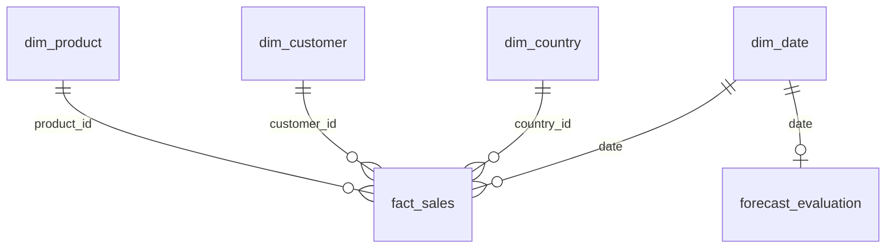

# Pipeline architecture

Each major stage owns a numbered executable file in the single `src/` directory. Shared functions live in `src/utils/`. `main.py` and direct-script execution both use `utils.runner`; numbered filenames are loaded by explicit `runpy.run_path`, never ordinary module imports.

The dependency map is deliberately conservative: stage 1 has no predecessor; each stage n requires a valid checkpoint for n−1. This gives a simple, fully ordered DAG. `DEPENDENCIES` is defined in `src/utils/runner.py`. A single-stage run does not silently create missing prerequisites; it gives the exact rebuild command.

Checkpoints in `.pipeline/NN.json` record execution duration, UTC completion time, configuration/code/SQL/runtime fingerprints, dependency-manifest hashes and SHA-256 for every output. Output existence alone is insufficient. Any implementation/config change conservatively invalidates all stages; `--all` rebuilds them while acquisition reuses verified raw bytes. Missing/modified outputs invalidate downstream dependencies. Tests verify corruption detection and true no-op resume.

A failed stage removes its prior successful checkpoint, records `.pipeline/last_failure.json`, and stops dependent work. Atomic table/text writes and a temporary constrained SQLite database protect published outputs. SQLite handles close explicitly on Windows. Checkpoints do not yet implement cross-process locks: run one production pipeline process per checkout.

The data path is raw → validated → cleaned/standardized → processed star and daily tables → features → models/reports/Power BI. Stage-owned chart manifests avoid cross-stage mutable checkpoint outputs. Stage 25 combines them into `visualizations/manifest.json`.

External services are limited to the public UCI download and package installation. Power BI Desktop import is manual. No hosted endpoint, production deployment, scheduler or cloud database is implied.

