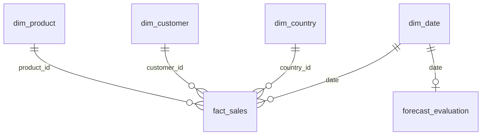

# Power BI data model

Import the six CSV tables from `data/powerbi/`. Stage 24 validates non-null unique dimension keys and every foreign key before publishing exports.

| One side | Many side | Direction |
|---|---|---|
| dim_product[product_id] | fact_sales[product_id] | Single, dimension to fact |
| dim_customer[customer_id] | fact_sales[customer_id] | Single |
| dim_country[country_id] | fact_sales[country_id] | Single |
| dim_date[date] | fact_sales[date] | Single |
| dim_date[date] | forecast_evaluation[date] | Single |

Mark `dim_date` as the date table using its continuous Date-typed `date` column. Forecast evaluation is daily, while fact_sales is transaction-line grain. Do not join the two facts directly or propagate product/customer/country filters to the forecast table: the model forecasts total retailer sales only. On the Predictive page, disable interactions from those slicers.

All dimensions are derived from the same UCI workbook. Product description is the latest observed label, suitable for descriptive reporting; it is never a predictive feature. Country belongs to the fact because customer location can vary. UNKNOWN is one explicit missing-customer member, not an inferred real person.

Do not summarize identifiers, dates, flags, or unit prices. Use explicit measures for ratios and distinct counts. Gross sales include non-merchandise/service codes. Signed value is not profit or audited accounting revenue. The final source day/month may be partial. Display that limitation visibly.

